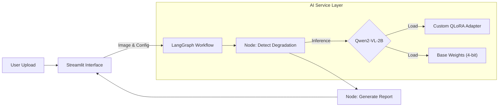

# 🔍 AI Image Degradation Inspector (Vision-Agent)

    

**온디바이스 환경(Consumer GPU)에서 동작하는 시각 언어 모델(sVLM) 기반의 이미지 훼손 분석 에이전트**입니다.
Qwen2-VL-2B 모델을 **QLoRA(Quantized Low-Rank Adaptation)** 방식으로 파인튜닝하여, 이미지의 Blur, Noise, Low Resolution 등의 훼손 여부를 전문적으로 진단하고 리포트를 생성합니다.

---

## 👨‍💻 프로젝트 핵심 성과 (Core Competencies)

이 프로젝트는 저의 GPU 자원(RTX 3070 Ti)을 기반으로 **AI 서비스의 생애주기(Data → Training → Serving)** 전반을 직접 구현한 결과물입니다.

### 1. AI 서비스 연구 & 모델 최적화 (Research & Optimization)
* **sVLM Post-Training:** 범용 모델(Qwen2-VL)을 도메인 특화(이미지 품질 분석) 모델로 만들기 위해 **Instruction Tuning**을 수행했습니다.
* **VRAM 최적화 전략:** RTX 3070 Ti (8GB) 환경에서의 원활한 학습과 추론을 위해 **4-bit Quantization (NF4)** 및 `bfloat16` 을 적용했습니다.
* **Custom Data Pipeline:** VLM 학습을 위해 텍스트-이미지 쌍을 효율적으로 처리하는 Custom Data Collator 및 데이터셋 전처리 파이프라인을 구축했습니다.

### 2. AI 에이전트 엔지니어링 (Agent Engineering)
* **LangGraph Orchestration:** 단순 함수 호출이 아닌, **StateGraph** 기반의 워크플로우를 설계하여 확장성 있는 에이전트 구조(Node/Edge)를 구현했습니다.
* **Dependency Injection:** `ImageAnalysisService` 클래스를 통해 모델 인스턴스를 관리하고 워크플로우에 주입하는 구조로 설계하여 코드의 유지보수성을 확보했습니다.

### 3. PoC 및 애플리케이션 개발 (Application Dev)
* **Streamlit UI:** 사용자가 모델의 효과(Base Model vs Custom Model)를 직관적으로 비교할 수 있는 인터랙티브 대시보드를 구현했습니다.
* **Model Caching:** Streamlit의 캐싱 메커니즘을 활용하여 모델 로딩 시간을 최소화하고 추론 효율성을 증대시켰습니다.

---

## 시스템 아키텍처 (Architecture)

### Workflow Overview
사용자가 이미지를 업로드하면, Streamlit UI는 LangGraph 워크플로우를 트리거합니다. 시스템은 설정에 따라 Base Model 또는 Fine-tuned QLoRA Adapter를 로드하여 분석을 수행합니다.



---

## 🚀 Technical Details

### 1. Model Training (QLoRA)
제한된 GPU 메모리(8GB) 한계를 극복하기 위해 양자화 학습(Quantization-Aware Training)을 적용했습니다.

* **Base Model:** `Qwen/Qwen2-VL-2B-Instruct`
* **Quantization:** BitsAndBytes (`load_in_4bit`, `nf4` type)
* **LoRA Config:**
    * Rank ($r$): 16
    * Alpha ($\alpha$): 32
    * Target Modules: `q_proj`, `k_proj`, `v_proj`, `o_proj`, `gate_proj`, `up_proj`, `down_proj` (Vision/Language 모듈 전체 타겟팅)
* **Environment:** RTX 3070 Ti, CUDA 11.8+

### 2. Inference Service
* **Efficient Loading:** `ImageAnalysisService` 클래스 초기화 시 모델을 VRAM에 상주시키고(Singleton 패턴과 유사), 추론 요청 시 Adapter의 활성화/비활성화를 동적으로 제어합니다.


---

## 💻 실행 방법 (Getting Started)

### 사전 요구 사항 (Prerequisites)
* Python 3.10 이상
* NVIDIA GPU (VRAM 6GB 이상 권장)
* CUDA Toolkit 설치 필요

### 설치 (Installation)

```bash
git clone [YOUR_GIT_URL]
cd Degradation

# 의존성 설치
pip install -r requirements.txt
```

### 실행 (Web UI)
Streamlit 웹 인터페이스를 통해 모델을 테스트할 수 있습니다.

```bash
streamlit run app.py
```

### 학습 실행 (Training)
새로운 데이터셋으로 모델을 학습시키려면 아래 코드를 실행합니다.

```bash
# Qlora_train.py 내부의 DATA_FILE 경로 확인 후 실행
python Qlora_train.py
```